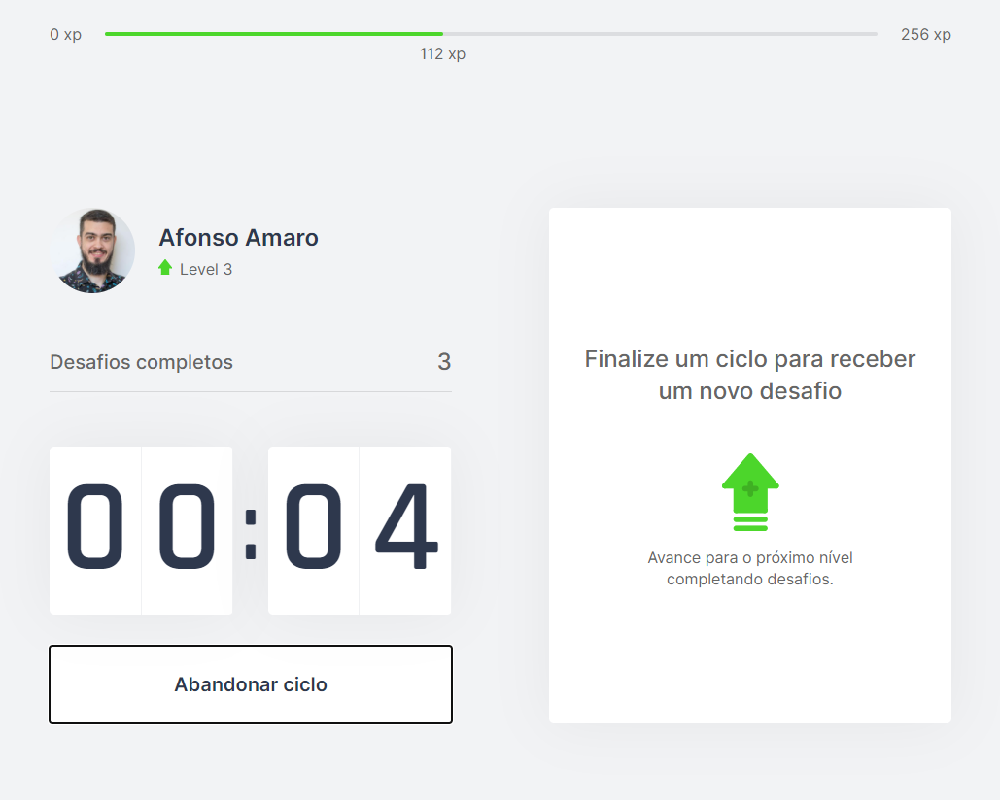
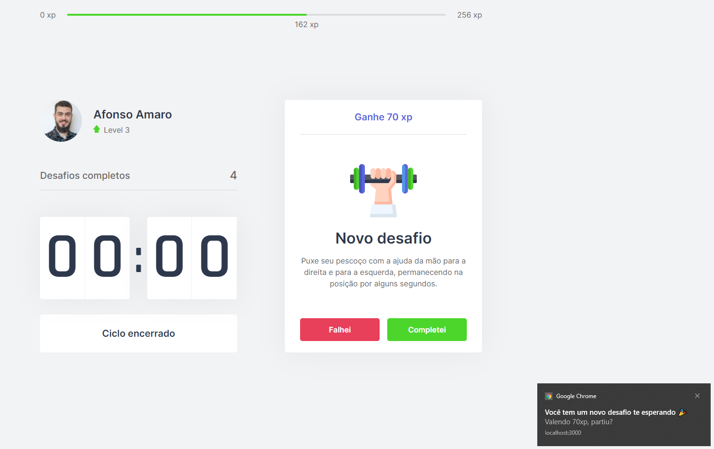

# Move.it (ReactJS & Next.js)


Desafio da Next Level Week #NLW4 da Rocketseat

- [Move.it (ReactJS & Next.js)](#moveit-reactjs--nextjs)
  - [Usage](#usage)
  - [Technologies](#technologies)
  - [Installation](#installation)
  - [Roadmap](#roadmap)
  - [Screenshots](#screenshots)
  - [License](#license)

## Usage

On the web app, recyclable collection points can register their locations and useful information, allowing people to find it at the mobile app.

## Technologies

This app features all the latest tools and practices in javascript/typescript stack!

- ⚛️ **React JS** — A JavaScript library for building user interfaces - [site](https://reactjs.org/)
- ⚛️ **Next JS** — The React Framework from Production - [site](https://nextjs.org/)

## Installation

Clone the project with the following command:

```sh
git clone https://github.com/doominating/move.it.git
```

Then, get in the project dir and install the dependencies:

```sh
cd Move.it
yarn install
```

Finally, you can start the application with:

```sh
yarn dev
```

## Roadmap

- (**IN PROGRESS**) Creates frontend project;
- (**TODO**) Creates backend project;
- (**TODO**) Creates mobile project;
- (**TODO**) Implements advanced features;
- Responsive app;
- PWA app;
- Dark theme;
- Login with github;
- Sidebar;
- Ranking;
- Share at Twitter;
- Refactoring to improve the code readability;

## Screenshots





## License

This project is licensed under the MIT License - see the [LICENSE](https://opensource.org/licenses/MIT) page for details.
